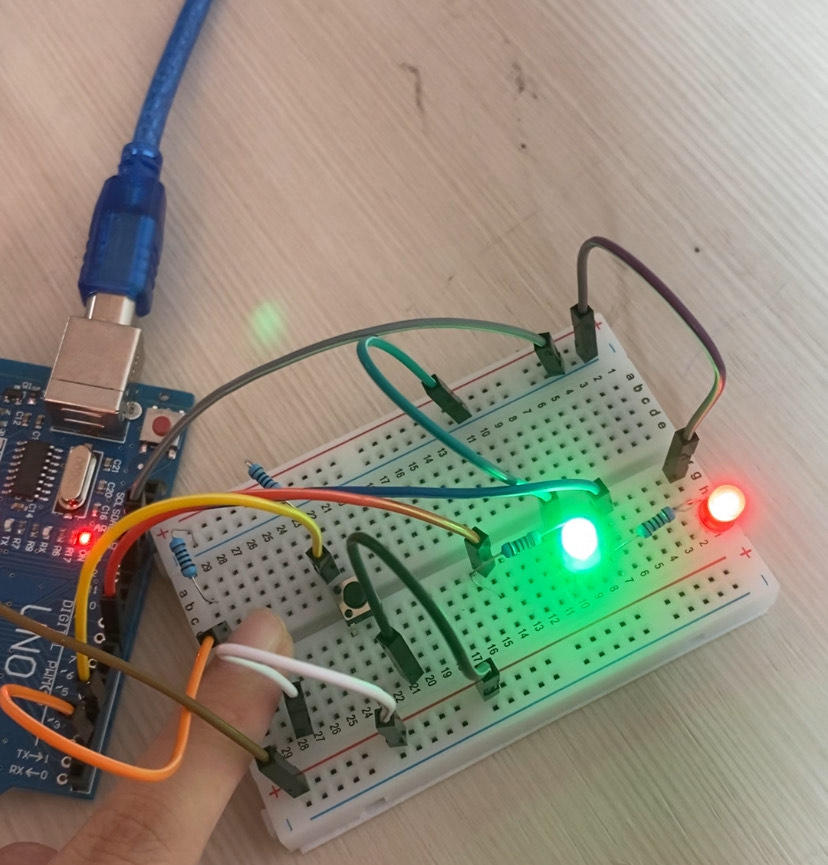

# $${\color{Yellow} Lumine}$$
$${\color{Yellow} Lumine}$$ is a simple two-button light switch using an Arduino Uno. Pressing one button turns both LEDs ON, and pressing the other button turns both LEDs OFF, as if a light switch.

## Project Goals

- Practice basic input (buttons) and output (LEDs) with Arduino
- Understand digitalRead/digitalWrite logic
- Build a simple, functional control circuit

## Components Used
- Arduino Uno R3 CH340
- Breadboard 400 points
- Red LED
- Green LED
- 10 jump wire (Male)
- 2 resistors 220Ω
- 2 resistros 10Ω

## How It Works

- When button 1 is pressed, both LEDs turn ON
- When button 2 is pressed, both LEDs turn OFF
- Simple digital logic using `if (digitalRead())`

## Arduino Pin Setup

| Pin | Connected To   |
|-----|----------------|
| 2   | Button 1       |
| 3   | Button 2       |
| 9   | Green LED (+)  |
| 10  | Red LED (+)    |
| GND | LED/button GND |
